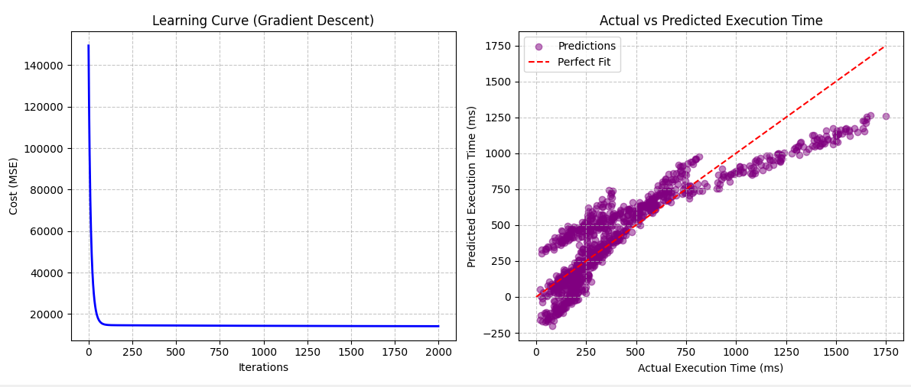
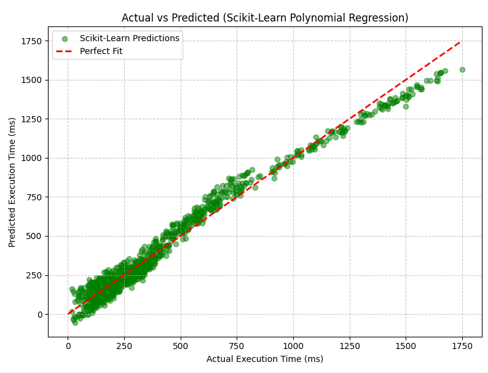

# ⏱️ Algorithm Execution Time Predictor

## 📖 Overview
This project is a Machine Learning model designed to predict the execution time of an algorithm based on its internal characteristics (like array size, randomness, and nested loops).

It was built to bridge the gap between **Computer Science fundamentals (Time Complexity / Big O)** and **Predictive Modeling**, applying concepts learned from Harvard's CS50 and Andrew Ng's Machine Learning Specialization.

## 🧠 The Core Problem
When analyzing algorithms (like sorting algorithms), execution time often scales non-linearly (e.g., $O(n^2)$). A standard linear model struggles to predict this accurately. This project demonstrates how **Feature Engineering** and **Polynomial Regression** solve this issue.

The repository features two implementations:
1. **From Scratch (Gradient Descent):** A raw implementation of Multiple Linear Regression using standard Python math to understand the "under the hood" mechanics.
2. **Scikit-Learn (Polynomial Regression):** A professional implementation using `PolynomialFeatures` to solve the "Underfitting" (High Bias) problem discovered in the linear model.

## 📂 Project Structure
```text
algo-execution-time-predictor/
├── data/
│   └── algorithms_data.csv        # 1000 rows of simulated non-linear data
├── src/
│   ├── data_generator.py          # Script used to generate the dataset
│   ├── predictor_from_scratch.py  # Linear Regression from scratch (Gradient Descent)
│   └── predictor_sklearn.py       # Polynomial Regression using Scikit-Learn
├── images/
│   ├── linear_underfitting.png    # Graph showing high bias (Underfitting)
│   └── polynomial_perfect_fit.png # Graph showing the optimized model
├── requirements.txt               # Project dependencies
└── README.md                      # Project documentation
```

## 📊 Results & Visualizations

### 1. The Underfitting Problem (Linear Regression)
When fitting a straight line to $O(n^2)$ data, the model suffers from High Bias. As seen below, the predictions (purple dots) form a curve and fail to perfectly align with the actual execution times.

(Cost/MSE was relatively high.)



### 2. The Solution (Polynomial Regression)
By applying Feature Engineering (Polynomial degree=2) via Scikit-Learn, the model successfully captures the interaction between variables (like `array_size` and `nested_loops`). The predictions (green dots) now perfectly align with reality.

(Cost/MSE dropped significantly.)



## 🛠️ How to Run Locally

1. Clone the repository:

```bash
git clone https://github.com/YOUR_USERNAME/algo-execution-time-predictor.git
cd algo-execution-time-predictor
```

2. Install dependencies:

```bash
pip install -r requirements.txt
```

3. Generate new data (Optional):

```bash
python src/data_generator.py
```

Run the models:

4. To see the from-scratch implementation:

```bash
python src/predictor_from_scratch.py
```

To see the optimized Scikit-Learn implementation:

```bash
python src/predictor_sklearn.py
```

## 🛠️ Technologies Used
- Python
- NumPy (Vectorization & Math)
- Matplotlib (Data Visualization)
- Scikit-Learn (Model Training & Feature Scaling)


